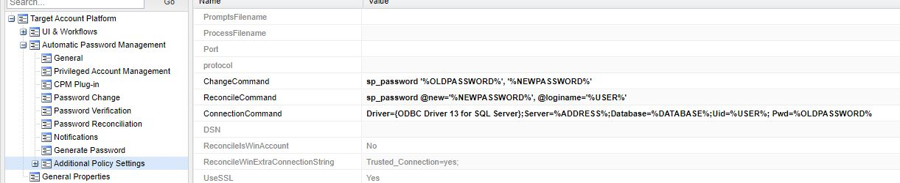
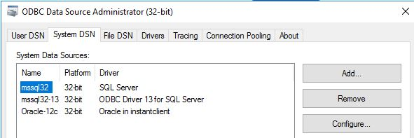
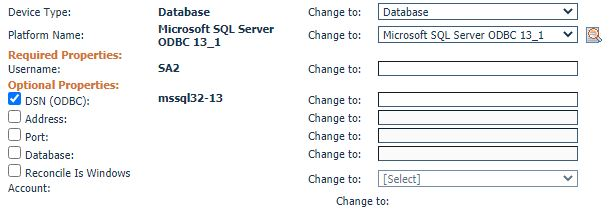

# CyberArk-CPMPlugins

### Follow steps below to integrate Connection to MSSql with ODBC DSN
1. Install Microsoft® ODBC Driver 13.1 for SQL Server®
```
https://www.microsoft.com/en-us/download/details.aspx?id=53339
```

2. Import platform via PVWA
```
Upload MSSql131.zip.
```

### Platform configuration

```
Make sure the Driver parameter is correspond to the driver in ODBC setting.
```


### Account configuration
```
Since this connection is using ODBC, the mandatory parameter will be only username and ODBC
```

